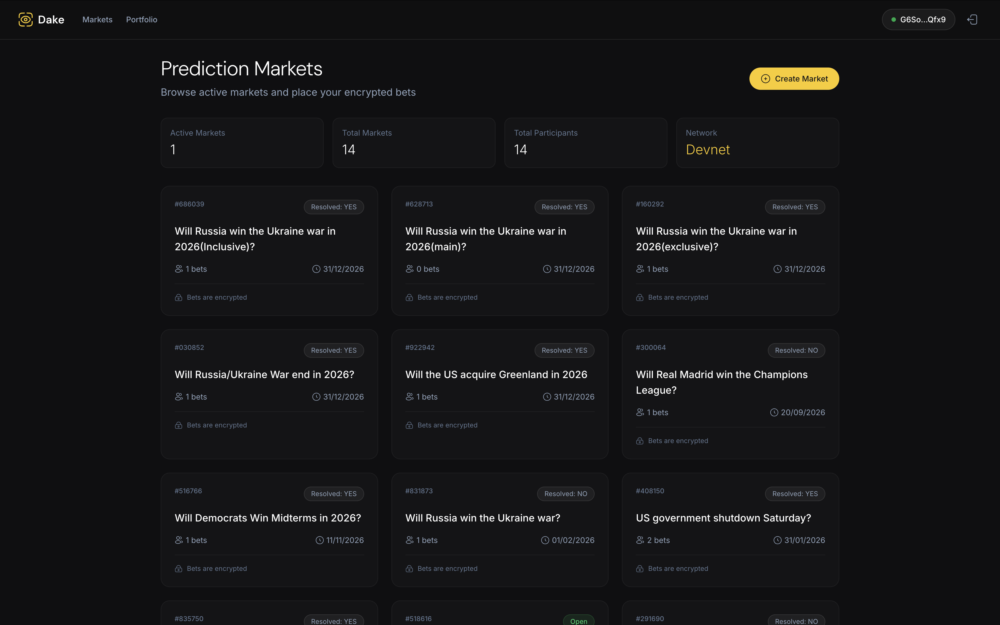
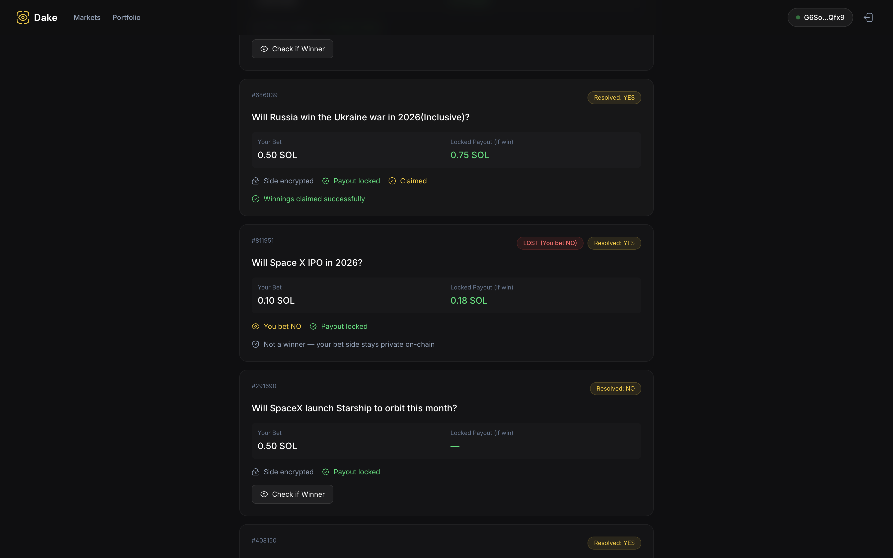

# Dake - Confidential Prediction Markets on Solana



The first prediction market where your bets are encrypted on-chain using Fully Homomorphic Encryption (FHE). No one can see which side you picked — not even the blockchain.

**Built with Solana + Inco Network + OpenAI Agents SDK**

## How It Works

1. **Place a bet** — Your YES/NO choice is encrypted via Inco FHE before hitting the chain
2. **Market resolves** — Admin sets the outcome (YES or NO)
3. **Check winner** — Encrypted comparison determines if you won (no one sees your side)
4. **Claim payout** — Ed25519 attested proof verifies your win on-chain, SOL is transferred

## Privacy Model

| Data | Visibility |
|------|-----------|
| Your bet side (YES/NO) | Encrypted (FHE) |
| Bet amount | Public |
| Winner result | Encrypted (only you can decrypt) |
| Payout claim | Verified via Ed25519 proof |



## Features

- **Encrypted betting** — Bet side hidden using `@inco/solana-sdk` encryption
- **Parimutuel odds** — Dynamic odds based on pool ratios with locked payouts
- **AI Market Analysis** — Built-in AI chatbot with real-time web search (OpenAI Agents SDK) to help analyze markets
- **On-chain verification** — Winner claims verified via Inco attested decrypt + Ed25519 signatures

## Tech Stack

- **Program**: Solana (Anchor Framework), Inco Lightning SDK (FHE)
- **Frontend**: Next.js 16, React 19, TypeScript, Tailwind CSS
- **AI**: OpenAI Agents SDK with web search tool

## Quick Start

### Prerequisites

- Node.js 18+
- Solana CLI & Anchor 0.31.1 (for program development only)

### Run the Frontend

```bash
cd app
cp .env.example .env.local
# Edit .env.local with your values (see Environment Variables below)
npm install
npm run dev
```

App runs at `http://localhost:3000`

### Environment Variables

```
NEXT_PUBLIC_SOLANA_RPC_URL=https://devnet.helius-rpc.com/?api-key=YOUR_KEY
NEXT_PUBLIC_PROGRAM_ID=5apEYrFFuxT7yExEFz56kfmuYvc1YxcActFCMWnYpQea
OPENAI_API_KEY=sk-...
```

### Creating a Market

Markets are created through the **Admin panel** at `/admin`. To create a market:

1. Navigate to `/admin` and authenticate
2. Connect a Solana wallet (this wallet becomes the market admin)
3. Enter the market question (e.g. "Will BTC hit $200k by March 2026?")
4. Set a resolution date
5. Submit — the market is created on-chain and appears on the homepage

> The admin wallet that creates a market is the only wallet that can resolve it (set the outcome to YES or NO).

### Deploy the Solana Program (optional)

See **[PROGRAM_ID.md](PROGRAM_ID.md)** for current deployment info (program ID, explorer link, upgrade authority).

To deploy your own:

```bash
yarn install
anchor build
anchor deploy --provider.cluster devnet
```

After deploying, update `NEXT_PUBLIC_PROGRAM_ID` in your `.env.local` with your new program ID.

## Project Structure

```
programs/dake/src/
  instructions/
    create_market.rs    # Create prediction markets
    place_bet.rs        # Place encrypted bets (FHE)
    check_winner.rs     # Encrypted winner determination
    claim_winnings.rs   # On-chain verified payout
  state/                # Market & Position account structs

app/src/
  app/
    markets/[id]/       # Market detail page with betting UI
    portfolio/          # View positions & claim winnings
    admin/              # Market creation & resolution
    api/chat/           # AI analysis streaming endpoint
  components/
    app/AIChatPanel.tsx # Slide-in AI chat with web search
```

## License

MIT
